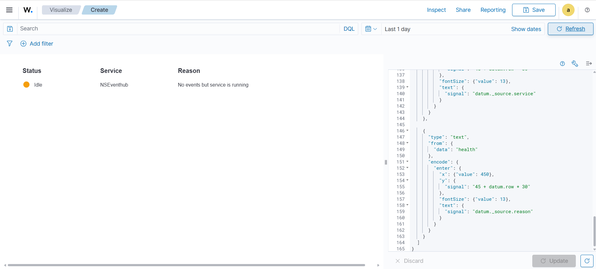

# IMPLEMENTATION PROCESS TO MONITOR AZURE EVENTHUB HEALTH

## Prerequisites 

**Access & Environment** 

- Logstash VM with sudo/root access, internet connectivity, and Python 3 + pip installed 

- Wazuh Indexer (OpenSearch) already deployed and reachable from the Logstash VM (host, port 9200), with valid username/password credentials 

- Network/firewall ports open between the Logstash VM and the Wazuh Indexer 

**Azure-Side Access** 

- An active Azure subscription with Owner/Contributor (or equivalent) rights to create an App Registration and assign roles 

- An existing Event Hub Namespace already deployed (the script only monitors it, doesn't create it) 

- Permission to create a Service Principal (App Registration) in Microsoft Entra ID 

- Ability to assign the Reader role on the Resource Group (via Access Control/IAM) to that App Registration 

**Values to Have Ready Before Running the Script** 

- Azure Tenant ID 

- Client ID + Client Secret (from the App Registration) 

- Subscription ID 

- Resource Group name 

- Event Hub Namespace name 

**Tooling**

- curl available for manual OpenSearch index/document testing 

- cron access on the VM for scheduling automation 

- Wazuh dashboard access with permission to create Vega visualizations 

## 1. WHAT YOU ARE BUILDING

```
Azure Event Hub Health Monitor (NEW)
│
▼
Python Script (runs on Logstash VM)
│
▼
Wazuh Indexer (azure-health-* index)
│
▼
Vega Dashboard + VSOC UI
```

This runs **independently of Azure Activity Logs**, so it solves your "idle vs active" problem.

---

## 2. CORE IDEA

We will NOT depend on:

- Azure Activity Logs (because they may be empty)

We WILL depend on:

- Azure Event Hub Metrics API (actual service health)

---

## 3. STEP 1 — INSTALL DEPENDENCIES ON LOGSTASH VM

Run this on your Logstash VM:

```bash
sudo apt update
sudo apt install -y python3 python3-pip
pip3 install requests
```

---

## 4. STEP 2 — CREATE WORKING DIRECTORY

```bash
sudo mkdir -p /opt/azure-health-monitor
cd /opt/azure-health-monitor
```

---

## 5. STEP 3 — CREATE THE PYTHON SCRIPT

Create file:

```bash
sudo nano azure_eventhub_health.py
```

Paste this FULL script

### 5.1 Full Script

```python
import requests
import json

from datetime import datetime, timezone, timedelta

import urllib3

urllib3.disable_warnings()

# =========================
# CONFIG (EDIT THIS)
# =========================

AZURE_TENANT_ID = "your-tenant-id"
AZURE_CLIENT_ID = "your-client-id"
AZURE_CLIENT_SECRET = "your-client-secret"
SUBSCRIPTION_ID = "your-subscription-id"
RESOURCE_GROUP = "your-resource-group"
NAMESPACE = "your-eventhub-namespace"

# Wazuh Indexer (OpenSearch)
OPENSEARCH_HOST = "https://xx.xx.xx.xx:9200"

INDEX_NAME = "azure-health-status"

# Threshold
# IDLE_THRESHOLD_MINUTES = 5

# =========================
# GET AZURE ACCESS TOKEN
# =========================

def get_token():
    url = f"https://login.microsoftonline.com/{AZURE_TENANT_ID}/oauth2/v2.0/token"

    data = {
        "grant_type": "client_credentials",
        "client_id": AZURE_CLIENT_ID,
        "client_secret": AZURE_CLIENT_SECRET,
        "scope": "https://management.azure.com/.default"
    }

    r = requests.post(url, data=data)
    return r.json()["access_token"]

# =========================
# GET EVENT HUB METRICS
# =========================

def get_eventhub_metrics(token):
    url = f"https://management.azure.com/subscriptions/{SUBSCRIPTION_ID}/resourceGroups/{RESOURCE_GROUP}/providers/Microsoft.EventHub/namespaces/{NAMESPACE}/providers/microsoft.insights/metrics?api-version=2018-01-01"

    headers = {"Authorization": f"Bearer {token}"}

    params = {
        "metricnames": "IncomingMessages,ActiveConnections",
        "interval": "PT5M",
        "aggregation": "Total"
    }

    r = requests.get(url, headers=headers, params=params)

    if r.status_code != 200:
        return None

    return r.json()

# =========================
# CHECK STATUS LOGIC
# =========================

def evaluate_status(metrics):

    if metrics is None:
        return "Inactive", "No response from Azure API"

    try:
        series = metrics["value"][0]["timeseries"][0]["data"]

        latest = series[-1]

        incoming = latest.get("total", 0)

        if incoming is None:
            incoming = 0

        if incoming > 0:
            return "Active", "Events are flowing"

        return "Idle", "No events but service is running"

    except:
        return "Inactive", "Error while parsing metrics"

# =========================
# SEND TO OPENSEARCH
# =========================

def send_to_opensearch(doc):

    url = f"{OPENSEARCH_HOST}/{INDEX_NAME}/_doc"

    headers = {
        "Content-Type": "application/json"
    }

    r = requests.post(
        url,
        auth=("username", "password"),
        headers=headers,
        json=doc,
        verify=False
    )

    print("Response:", r.text)

    return r.status_code

# =========================
# MAIN
# =========================

def main():

    token = get_token()
    metrics = get_eventhub_metrics(token)

    status, reason = evaluate_status(metrics)

    doc = {
        "@timestamp": datetime.now(timezone.utc).isoformat(),
        "source": "azure_eventhub_health",
        "service": NAMESPACE,
        "status": status,
        "reason": reason
    }

    code = send_to_opensearch(doc)

    print("Status:", status)
    print("Reason:", reason)
    print("OpenSearch response:", code)


if __name__ == "__main__":
    main()
```

### 5.2 Why Following Values Are Needed

```python
AZURE_TENANT_ID = "your-tenant-id"
AZURE_CLIENT_ID = "your-client-id"
AZURE_CLIENT_SECRET = "your-client-secret"
SUBSCRIPTION_ID = "your-subscription-id"
RESOURCE_GROUP = "your-resource-group"
NAMESPACE = "your-eventhub-namespace"
```

You are trying to do this:

"Check Azure Event Hub health from outside Azure (your VM)"

Azure will NOT allow random servers to query its infrastructure.

So it requires:

### 5.3 Identity + Permission Model

Your VM must prove:

- "I am allowed to read Azure monitoring data"

That is why we use:

Service Principal (App Registration in Entra ID)

This is what gives you:

| Field | Purpose |
|---|---|
| `tenant_id` | Which Azure directory |
| `client_id` | Which app is calling Azure |
| `client_secret` | Password of that app |
| `subscription_id` | Which Azure subscription |
| `resource_group` | Where Event Hub lives |
| `namespace` | Actual Event Hub service |

### 5.4 Where to Get Each Value

Let's go step-by-step.

#### AZURE TENANT ID

##### Where to Find:

Azure Portal → Microsoft Entra ID → Overview

You will see:

```
Tenant ID
```

Example:

```
72f988bf-86f1-41af-91ab-2d7cd011db47
```

#### CLIENT ID + CLIENT SECRET (IMPORTANT)

"If you have not created any application in Entra ID yet"

Then you MUST create one. This is mandatory.

#### Create App Registration

Go to:

```
Azure Portal
→ Microsoft Entra ID
→ App registrations
→ New registration
```

Fill:

| Field | Value |
|---|---|
| Name | `azure-health-monitor` |
| Supported account types | Single tenant |

Click **Register**

#### After Creation You Will Get:

##### CLIENT ID

Inside:

```
App registration → Overview
```

Copy:

```
Application (client) ID
```

##### TENANT ID (again)

Same screen:

```
Directory (tenant) ID
```

#### Create CLIENT SECRET

Go to:

```
App registration
→ Certificates & secrets
→ Client secrets
→ New client secret
```

Copy:

```
VALUE (NOT ID)
```

Important: You will only see it once.

#### SUBSCRIPTION ID

##### Where:

Azure Portal → Subscriptions

Click your subscription → You will see:

```
Subscription ID
```

#### RESOURCE GROUP

Go to:

```
Azure Portal
→ Resource groups
```

Find the one where Event Hub is deployed:

Example:

```
rg-log-pipeline-prod
```

That name is your:

```
RESOURCE_GROUP
```

#### EVENT HUB NAMESPACE

Go to:

```
Azure Portal
→ Event Hubs
```

Click your namespace (not event hub itself)

Example:

```
log-namespace-prod
```

That is your:

```
NAMESPACE
```

#### VERY IMPORTANT STEP (Most People Miss This)

After creating App Registration, it has NO permission by default.

You must assign a role.

##### Give Permission to App

Go to:

```
Resource Group → Access Control (IAM)
→ Add role assignment
```

Assign:

```
Reader role
```

to your App Registration.

##### Why Reader Role?

Because your script only needs:

- Read metrics
- Read Event Hub status

No write access needed.

### 5.5 Final Mapping Summary

| Variable | Where to Get |
|---|---|
| `tenant_id` | Microsoft Entra ID → Overview |
| `client_id` | App Registration → Overview |
| `client_secret` | App Registration → Certificates & Secrets |
| `subscription_id` | Azure Subscriptions |
| `resource_group` | Resource Groups |
| `namespace` | Event Hubs → Namespace name |

### 5.6 Simple Mental Model

Think like this:

```
Tenant ID       → Company identity
Client ID       → Application identity
Client Secret   → Password
Subscription    → Billing + container
Resource Group  → Folder
Namespace       → Actual Event Hub service
```

**Note:** After adding all the required information to the Python script, make sure ports are opened between the VMs, otherwise you will get errors while running the script.

To make sure the connection is good before running the script directly, try to perform the following manually first:

### 5.7 Test Index Creation First

Before running the Python script, create the index manually.

Run:

```bash
curl -k -u username:Password \
  -X PUT \
  "https://XXX.XXX.XX.43:9200/azure-health-status"
```

Expected:

```json
{
  "acknowledged": true
}
```

If it already exists:

```json
{
  "error":"resource_already_exists_exception"
}
```

That's fine.

### 5.8 Test Document Insert Manually

Run:

```bash
curl -k -u username:Password \
  -X POST \
  "https://XXX.XXX.XX.43:9200/azure-health-status/_doc" \
  -H "Content-Type: application/json" \
  -d '{
    "@timestamp":"2026-07-08T12:00:00Z",
    "status":"active",
    "service":"eventhub"
  }'
```

Expected:

```json
{
  "result":"created"
}
```

### 5.9 Verify Document Exists

Run:

```bash
curl -k -u username:Password \
  "https://XXX.XXX.XX.43:9200/azure-health-status/_search?pretty"
```

You should see:

```json
{
  "hits": {
    "hits": [
      {
        "_source": {
          "status": "active"
        }
      }
    ]
  }
}
```

---

## 6. STEP 4 — MAKE SCRIPT EXECUTABLE

```bash
chmod +x azure_eventhub_health.py
```

---

## 7. STEP 5 — RUN MANUALLY TEST

```bash
python3 azure_eventhub_health.py
```

### Expected Output:

```
Status: idle
Reason: no events but service running
OpenSearch response: 201
```

If you see 201, data is successfully reaching Wazuh Indexer.

---

## 8. STEP 6 — VERIFY IN WAZUH INDEXER

Run:

```bash
curl -k -u username:Password \
  "https://XXX.XXX.XX.43:9200/azure-health-status/_search?pretty"
```

Expected:

```json
{
  "hits": {
    "hits": [
      {
        "_source": {
          "status": "active",
          "service": "eventhub"
        }
      }
    ]
  }
}
```

---

## 9. STEP 7 — AUTOMATE EVERY 1 MINUTE (CRON)

### 9.1 Create a Log File

Create a directory for script logs.

```bash
sudo mkdir -p /var/log/azure-health-monitor
```

Create a log file:

```bash
sudo touch /var/log/azure-health-monitor/azure_health.log
```

Set permissions:

```bash
sudo chmod 666 /var/log/azure-health-monitor/azure_health.log
```

#### Purpose

If the cron job fails later, you'll have a place to see errors.

### 9.2 Find Python Location

Run:

```bash
which python3
```

Example output:

```
/usr/bin/python3
```

Remember this path.

#### Purpose

Cron jobs use a minimal environment and often cannot find Python automatically.

### 9.3 Test Using Full Path

Run:

```bash
/usr/bin/python3 /opt/azure-health-monitor/azure_eventhub_health.py
```

If it works, you're ready for automation.

### 9.4 Open Crontab

Run:

```bash
crontab -e
```

If prompted:

```
Select an editor
```

Choose:

```
1
```

for nano.

### 9.5 Add Cron Entry

Add this line at the bottom:

```
* * * * * /usr/bin/python3 /opt/azure-health-monitor/azure_eventhub_health.py >> /var/log/azure-health-monitor/azure_health.log 2>&1
```

Save and exit.

For nano:

```
CTRL+X
Y
ENTER
```

### 9.6 Understanding the Cron Syntax

```
* * * * *
│ │ │ │ │
│ │ │ │ └── Day of week
│ │ │ └──── Month
│ │ └────── Day of month
│ └──────── Hour
└────────── Minute
```

So:

```
* * * * *
```

means:

```
Every minute
```

### 9.7 Understanding the Command

`/usr/bin/python3`

Runs Python.

`/opt/azure-health-monitor/azure_eventhub_health.py`

Your monitoring script.

`>>`

Append output to a file.

`/var/log/azure-health-monitor/azure_health.log`

Log file location.

`2>&1`

Redirect errors to the same log file.

Without this, Python errors are lost.

### 9.8 Verify Cron Is Installed

Run:

```bash
crontab -l
```

Expected:

```
* * * * * /usr/bin/python3 /opt/azure-health-monitor/azure_eventhub_health.py >> /var/log/azure-health-monitor/azure_health.log 2>&1
```

#### Purpose

Confirms cron saved correctly.

### 9.9 Wait 2 Minutes

Wait about 2–3 minutes.

Then check:

```bash
cat /var/log/azure-health-monitor/azure_health.log
```

Expected:

```
Status: active
Reason: events flowing
OpenSearch response: 201

Status: active
Reason: events flowing
OpenSearch response: 201
```

Every minute you should see a new entry.

### 9.10 Verify New Documents Are Arriving

Run:

```bash
curl -k -u username:Password \
  "https://XXX.XXX.XX.43:9200/azure-health-status/_count?pretty"
```

Example:

```json
{
  "count" : 15
}
```

Wait one minute.

Run again:

```bash
curl -k -u username:Password \
  "https://XXX.XXX.XX.43:9200/azure-health-status/_count?pretty"
```

Example:

```json
{
  "count" : 16
}
```

#### Purpose

Confirms the automation is continuously creating health records.

### 9.11 Verify Latest Status Document

Run:

```bash
curl -k -u username:Password \
  "https://XXX.XXX.XX.43:9200/azure-health-status/_search?size=1&sort=@timestamp:desc&pretty"
```

This shows the most recent health record.

---

## 10. FOR VISUALIZATION

Login into Wazuh.

### 10.1 Create New Vega Visualization

☰ menu → Visualize → Create visualization
Scroll down and select: Vega

You will see a text editor with sample Vega code. **Delete everything** in that editor and paste the exact code below.

### 10.2 Paste This Complete Vega Script

```json
{
  "$schema": "https://vega.github.io/schema/vega/v5.json",
  "autosize": "none",
  "width": 1000,
  "height": 300,
  "title": {
    "text": "Azure EventHub Health",
    "fontSize": 20,
    "anchor": "start"
  },
  "data": [
    {
      "name": "health",
      "url": {
        "%context%": true,
        "index": "azure-health-status",
        "body": {
          "size": 1,
          "sort": [
            {
              "@timestamp": {
                "order": "desc"
              }
            }
          ]
        }
      },
      "format": {
        "property": "hits.hits"
      },
      "transform": [
        {
          "type": "window",
          "ops": ["row_number"],
          "as": ["row"]
        }
      ]
    }
  ],
  "marks": [
    {
      "type": "text",
      "encode": {
        "enter": {
          "x": {"value": 50},
          "y": {"value": 40},
          "fontSize": {"value": 16},
          "fontWeight": {"value": "bold"},
          "text": {"value": "Status"}
        }
      }
    },
    {
      "type": "text",
      "encode": {
        "enter": {
          "x": {"value": 250},
          "y": {"value": 40},
          "fontSize": {"value": 16},
          "fontWeight": {"value": "bold"},
          "text": {"value": "Service"}
        }
      }
    },
    {
      "type": "text",
      "encode": {
        "enter": {
          "x": {"value": 450},
          "y": {"value": 40},
          "fontSize": {"value": 16},
          "fontWeight": {"value": "bold"},
          "text": {"value": "Reason"}
        }
      }
    },
    {
      "type": "symbol",
      "from": {
        "data": "health"
      },
      "encode": {
        "enter": {
          "x": {"value": 60},
          "y": {
            "signal": "40 + datum.row * 30"
          },
          "size": {"value": 250},
          "shape": {"value": "circle"}
        },
        "update": {
          "fill": {
            "signal": "datum._source.status === 'Active' ? '#22c55e' : datum._source.status === 'Idle' ? '#f59e0b' : '#ef4444'"
          }
        }
      }
    },
    {
      "type": "text",
      "from": {
        "data": "health"
      },
      "encode": {
        "enter": {
          "x": {"value": 80},
          "y": {
            "signal": "45 + datum.row * 30"
          },
          "fontSize": {"value": 13},
          "text": {
            "signal": "datum._source.status"
          }
        }
      }
    },
    {
      "type": "text",
      "from": {
        "data": "health"
      },
      "encode": {
        "enter": {
          "x": {"value": 250},
          "y": {
            "signal": "45 + datum.row * 30"
          },
          "fontSize": {"value": 13},
          "text": {
            "signal": "datum._source.service"
          }
        }
      }
    },
    {
      "type": "text",
      "from": {
        "data": "health"
      },
      "encode": {
        "enter": {
          "x": {"value": 450},
          "y": {
            "signal": "45 + datum.row * 30"
          },
          "fontSize": {"value": 13},
          "text": {
            "signal": "datum._source.reason"
          }
        }
      }
    }
  ]
}
```

### 10.3 Click Update

Click the blue "Update" button at the bottom of the editor.

You will immediately see a table-style panel with one row for the eventhub service showing a green circle + "Active" or red circle + "Inactive" or orange circle + "Idle". It is something like the image below.



### 10.4 Save

Click Save top right
Name: `azure eventhub health status panel`
Click Save


